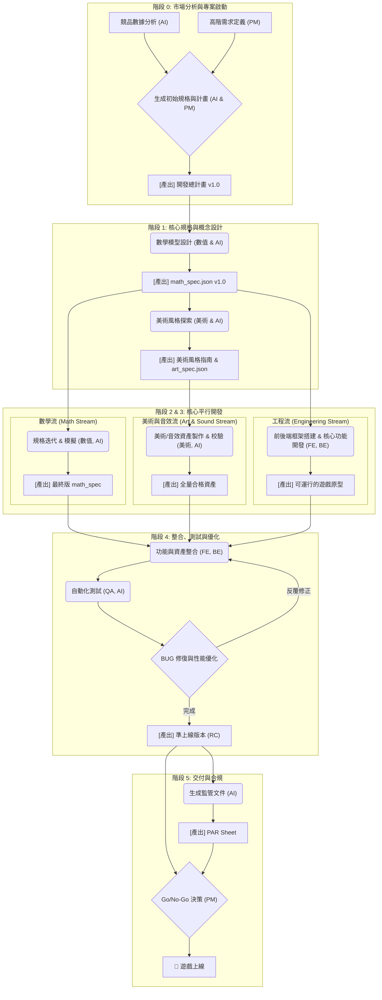

# AI 賦能的規格驅動老虎機開發總計畫 (v1.0)

## 開發流程總覽圖 (Development Workflow Overview)



---

## 1. 總覽與核心理念 (Overview & Core Philosophy)

本文件旨在建立一套以「規格驅動開發 (Spec-Driven Development, SDD)」為核心，並由 AI Agent 全面輔助的次世代老虎機遊戲開發流程。此流程涵蓋從市場分析、產品設計、數學建模、美術開發、前後端工程，到最終測試與交付的全生命週期。

### 1.1 核心理念

- **規格即是真理 (Spec as Truth):** 所有開發環節的唯一真理來源是結構化的「規格檔案」（如 `math_spec.json`, `art_spec.json`）。任何修改都應從規格發起，確保各職能工作基於同一套標準，杜絕溝通誤差。

- **AI 輔助設計與開發 (AI-Assisted Design & Development):** AI Agent 作為核心開發夥伴，參與到數學設計、程式碼生成、資產校驗、數據分析等各個環節，旨在提升效率、發掘創意並保證品質。

- **快速迭代與自動化驗證 (Rapid Iteration & Automated Verification):** 透過「`設計 -> 規格 -> 模擬/校驗 -> 分析 -> 優化`」的自動化閉環，我們能在極短時間內完成設計的調整與驗證，將開發週期從數月縮短至數週。

- **左移品質 (Shift-Left Quality):** 將品質保證（QA）的介入點提前至專案啟動初期。透過自動化腳本校驗規格、資產與確定性，最大程度地避免後期整合階段的昂貴返工。

### 1.2 方案目標

1.  **縮短開發週期 50% 以上**：透過規格化與平行開發實現。
2.  **降低溝通與管理成本 80%**：以規格文件取代反覆會議與口頭需求。
3.  **提升品質與一致性**：自動化驗證數學、美術與程式碼的準確性。
4.  **數據驅動創新**：基於競品數據分析進行產品設計，提高市場成功率。

---

## 2. 團隊角色與 AI 協作 (Team Roles & AI Collaboration)

| 角色 | 主要職責 | AI 協作方式 |
| :--- | :--- | :--- |
| **專案經理 (PM)** | 制定高階需求、管理時程、控制風險 | - 根據需求生成計畫初稿<br>- 追蹤 AI 生成的任務與報告 |
| **數值企劃** | 設計數學模型 (RTP/波動率)、賠付表、輪帶 | - 將自然語言轉換為 `math_spec.json`<br>- 執行調參優化<br>- 生成模擬報告 |
| **美術設計** | 產出風格、符號、背景、UI、動畫等視覺資產 | - 生成概念設計與風格建議<br>- 根據規格生成資產清單<br>- 校驗資產命名與尺寸 |
| **前端工程師 (FE)** | 基於規格渲染遊戲畫面、實作互動邏輯 | - 生成前端 UI 框架程式碼<br>- 根據規格渲染元件<br>- 產生視覺回歸測試腳本 |
| **後端工程師 (BE)** | 實作遊戲伺服器邏輯、確保隨機性與安全性 | - 根據規格生成核心引擎程式碼<br>- 產生 API 整合測試案例<br>- 建立監控腳本 |
| **測試工程師 (QA)** | 驗證數學模型、測試前後端整合、自動化測試 | - 生成數學驗證與 E2E 測試腳本<br>- 分析模擬數據，找出邊界案例<br>- 執行視覺與效能回歸測試 |
| **AI Agent** | 跨職能開發夥伴 | - **需求翻譯器**<br>- **數學設計師**<br>- **程式碼生成器**<br>- **數據分析師**<br>- **資產校驗員**<br>- **創意夥伴** |

---

## 3. 統一開發流程 (Unified Development Workflow)

整個開發過程分為六個主要階段，部分階段可平行進行。

### **階段 0：市場分析與專案啟動 (5-7 天)**

- **目標**：確定產品方向與核心玩法，建立所有規範與計畫。
- **產出**：競品分析報告、`math_spec.json` v0.1、`art_spec.json` v0.1、開發總計畫。
- **流程**：
    1.  **競品分析 (AI輔助)**：
        - 收集競品數據（如 `tb_pg_wild_bounty_v1_004`）。
        - AI 執行數據分析，產出競品數學模型報告（RTP、波動率、特色玩法頻率與收益）。
    2.  **定義產品高階需求**：PM 根據市場分析，提出新遊戲的核心定位與目標玩家。
    3.  **建立初始規格**：AI 根據 PM 需求和競品分析，生成 `math_spec.json` 和 `art_spec.json` 的 v0.1 版本。
    4.  **確立 DoD 與規範**：團隊對齊完成定義（Definition of Done）、美術資產規範、技術選型與 CI/CD 策略。

### **階段 1：核心規格與概念設計 (Week 1-2)**

- **目標**：穩定核心玩法規格，確立美術風格。
- **產出**：`math_spec.json` v1.0、美術風格指南 (Style Guide)、首批符號設計稿。
- **流程**：
    1.  **數學模型設計 (AI輔助)**：數值企劃與 AI 合作，完成輪帶、賠付表設計，使模擬 RTP 趨近目標。
    2.  **美術風格探索 (AI輔助)**：美術設計師使用 AI 生成多種主題風格（如「太空海盜」、「賽博忍者」）的概念圖，由團隊決選。
    3.  **規格細化**：根據確定的玩法與風格，擴充規格檔，定義所有符號、UI 元件與多語系需求。

### **階段 2 & 3: 核心平行開發 (Week 3-6)**

- **目標**：完成所有核心開發工作，包括數學調優、資產製作和前後端工程實現。
- **核心原則**：一旦 `math_spec.json` 和 `art_spec.json` 的 v1.0 版本確立，**數學、美術、音效、前端和後端的工作流將最大程度地平行展開**，各自以規格文件為依據，獨立進行開發與驗證。
- **產出**：功能完整、資產齊備的遊戲版本；最終版的數學規格。
- **平行工作流 (Parallel Streams)**：
    - **數學流 (Math Stream)**：數值企劃與 AI 持續進行「`規格 -> 模擬 -> 分析 -> 調參`」的循環，對遊戲體驗進行精細打磨，直至產出最終版 `math_spec.json`。
    - **美術與音效流 (Art & Sound Stream)**：美術與音效團隊根據 `art_spec.json` 和風格指南，製作全量的視覺資產（符號、背景、UI、動畫）和音訊檔案。過程中，AI Agent 會持續校驗產出資產的命名、尺寸與格式，確保其合規性。
    - **工程流 (Engineering Stream)**：
        - **後端(BE)**：基於 `math_spec.json` 開發伺服器端的核心遊戲引擎與 API。
        - **前端(FE)**：基於規格文件和初步美術資產，開發遊戲主場景、UI 框架與互動邏輯，實現可獨立運行的遊戲原型。

### **階段 4：整合、測試與優化 (Week 7)**

- **目標**：確保遊戲品質、性能與數學模型準確性。
- **產出**：測試報告、性能分析報告、最終版規格。
- **流程**：
    1.  **數學最終驗證**：QA 執行大規模模擬，確保最終 RTP 與規格誤差在允許範圍內。
    2.  **E2E 測試 (AI輔助)**：QA 使用 AI 生成的自動化腳本，測試完整的遊戲流程。
    3.  **視覺回歸測試**：使用 Storybook 或 Chromatic 進行 UI 截圖比對，確保視覺一致性。
    4.  **性能優化**：針對首屏載入時間、FPS、API 響應速度進行壓力測試與優化。

### **階段 5：交付與合規 (Week 8)**

- **目標**：產出可上線的最終版本及所有必要文件。
- **產出**：遊戲發布包、監管報告、審計日誌。
- **流程**：
    1.  **打包與部署**：產出最終遊戲包，部署至預備環境。
    2.  **生成合規文件 (AI輔助)**：AI 根據規格與模擬結果，自動生成提交給監管機構的 PAR Sheet 與數學報告。
    3.  **上線審批**：進行最終的 Go/No-Go 決策。

---

## 4. 規格與資產標準

### 4.1 遊戲規格 (`spec.json`)

遊戲唯一真理來源，定義所有核心參數。
```json
{
  "gameInfo": {
    "gameName": "Gemini's Treasure",
    "reels": 5,
    "rows": 3,
    "targetRTP": 0.96,
    "targetVolatility": "High"
  },
  "symbols": {
    "H1": { "name": "Gem", "isWild": false },
    "SCATTER": { "name": "Scatter", "isScatter": true }
  },
  "reels": [ ... ],
  "paytable": { ... },
  "features": { ... }
}
```

### 4.2 美術資產規範

- **命名**：全小寫、底線分隔：`{category}_{context}_{state}_{lang}.{ext}`。
  - `sym_dragon_normal.png`
  - `btn_spin_down.png`
  - `tx_win_en_glow.png`
- **尺寸**：
  - 符號：240×240px (含 10% 留白)
  - 背景：1080×1920px
  - 按鈕：最小 88×88px
- **格式與壓縮**：
  - PNG: 使用 pngquant 壓縮
  - JPG: 使用 mozjpeg 壓縮 (Q85-90)
  - 音訊: MP3 192kbps 或 OGG 128kbps

---

## 5. 品質、風險與變更管理

### 5.1 品質門 (Quality Gates)

- **規格**：提交 PR 前，必須通過 Schema 與邏輯驗證腳本。
- **美術**：入庫前，必須通過 `check-assets.js` 腳本，達成命名、尺寸、格式 100% 合規。
- **程式碼**：CI 中單元測試覆蓋率 > 80%，E2E 測試通過。
- **性能**：首屏載入 < 2s，轉軸 FPS ≥ 60。

### 5.2 風險管理

| 風險 | 影響 | 機率 | 應對策略 |
| :--- | :--- | :--- | :--- |
| 規格變更頻繁 | 高 | 中 | 凍結規格變更窗口；重大變更採 RFC 流程。 |
| AI 生成內容品質不穩 | 中 | 低 | Code Review；AI 產出作為初稿，由人類專家審核。 |
| 資產交付延遲 | 中 | 中 | AI 自動生成缺漏清單，每日站會追蹤。 |
| 效能瓶頸 | 中 | 中 | 提早進行壓力測試，FE/BE 共同制定優化方案。 |

### 5.3 變更管理 (RFC)

- **適用場景**：新增符號、修改輪帶尺寸、RTP 目標變動 > 1% 等重大變更。
- **流程**：`提案 -> 影響評估 -> 實作 -> 驗證 -> 審核 -> 合併`。
- **必要附件**：規格差異、模擬報告、資產變更清單、QA 測試計畫。

---

## 6. 附錄：關鍵工具與指令

```bash
# 1. 驗證所有規格檔
npm run validate:all-specs

# 2. 模擬單一遊戲並輸出報告
npm run cli -- simulate -s specs/games/dragon-gold.json --spins 100000000 -o reports/

# 3. 檢查美術資產是否符合規範
node scripts/check-assets.js --manifest assets/manifest.json

# 4. 執行 E2E 遊戲流程測試
npm run test:e2e
```
