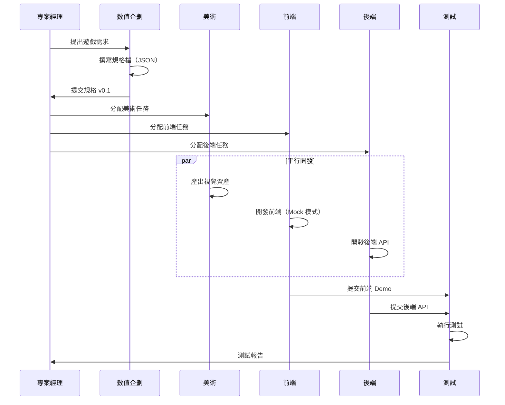

# Slot Game 規格驅動開發（SDD）方案計劃書

## 文件資訊
- **專案名稱**：規格驅動老虎機遊戲開發平台
- **版本**：v1.0
- **制定日期**：2025-10-06
- **適用範圍**：線上老虎機遊戲全生命週期開發

---

## 一、方案概述

### 1.1 核心理念

**規格驅動開發（Spec-Driven Development, SDD）** 是一種以「遊戲規格檔」為中心的開發模式，透過結構化的 JSON Schema 定義遊戲數學模型、視覺資產、互動邏輯，讓跨職能團隊（美術、前端、後端、數值、測試）基於同一份「真理來源」（Single Source of Truth）協同作業。

### 1.2 方案目標

1. **縮短開發週期**：規格確定後，各職能可平行開發
2. **降低溝通成本**：規格即文檔，減少需求誤解
3. **提升品質**：自動化驗證數學模型與視覺一致性
4. **快速迭代**：調整規格即可產出新版本，無需大量改 code
5. **AI 友善**：結構化規格便於 AI 輔助生成程式碼與資產

### 1.3 技術架構

```
┌─────────────────────────────────────────────────────┐
│                  遊戲規格檔（JSON）                    │
│  - 數學模型（賠付表、輪帶、機率）                       │
│  - 視覺資產清單（符號、動畫、音效）                     │
│  - UI 配置（按鈕位置、文字）                            │
│  - 後端整合（API 端點、事件）                           │
└──────────────┬──────────────────────────────────────┘
               │
       ┌───────┴────────┐
       │  Schema 驗證器  │（Zod / JSON Schema）
       └───────┬────────┘
               │
    ┌──────────┼──────────┬──────────┬──────────┐
    │          │          │          │          │
┌───▼───┐  ┌──▼───┐  ┌──▼───┐  ┌──▼───┐  ┌──▼───┐
│ 美術  │  │ 前端 │  │ 後端 │  │ 數值 │  │ 測試 │
│ 資產  │  │ 渲染 │  │ 引擎 │  │ 調參 │  │ 驗證 │
└───────┘  └──────┘  └──────┘  └──────┘  └──────┘
```

---

## 二、角色職責與工作流程

### 2.1 數值企劃（Game Math Designer）

#### 職責
- 設計遊戲數學模型（RTP、波動度、命中率）
- 制定賠付表與輪帶配置
- 定義特殊功能（免費遊戲、乘數、累積獎池）

#### 工作流程
1. **撰寫規格檔**
   - 使用 JSON 格式定義遊戲參數
   - 範例：`specs/games/dragon-gold.json`
   ```json
   {
     "meta": {
       "name": "龍金傳奇",
       "version": "1.0.0",
       "targetRTP": 0.96,
       "volatility": "medium-high"
     },
     "reels": {
       "columns": 5,
       "rows": 3,
       "strips": [...]
     },
     "paytable": [
       { "symbol": "龍", "ofAKind": 5, "payout": 500 },
       ...
     ]
   }
   ```

2. **本地驗證**
   ```bash
   npm run cli -- validate -s specs/games/dragon-gold.json
   npm run cli -- simulate -s specs/games/dragon-gold.json --spins 1000000
   ```

3. **調參優化**
   - 若 RTP 不符預期，使用 AI 優化器：
   ```bash
   npm run cli -- optimize -s specs/games/dragon-gold.json \
     --targetRTP 0.96 --targetVol 25 --iters 100
   ```

4. **提交審核**
   - 將規格檔提交至 Git，觸發 CI/CD 自動驗證

#### 交付物
- ✅ `specs/games/{game-name}.json`
- ✅ 數學模型報告（RTP、波動度、命中率分布）
- ✅ 監管認證文件（若需要）

---

### 2.2 美術設計（Art Designer）

#### 職責
- 根據規格產出視覺資產（符號、背景、動畫）
- 確保資產命名與規格檔一致

#### 工作流程
1. **讀取規格檔取得資產清單**
   - 規格檔定義所需符號：
   ```json
   {
     "symbols": [
       { "id": "dragon", "type": "regular", "name": "龍" },
       { "id": "phoenix", "type": "wild", "name": "鳳凰" },
       { "id": "scatter", "type": "scatter", "name": "金幣" }
     ]
   }
   ```

2. **設計與輸出資產**
   - 依規範產出檔案：
   ```
   assets/
   ├── symbols/
   │   ├── dragon.png (512x512)
   │   ├── dragon_anim.spine
   │   ├── phoenix.png
   │   └── scatter.png
   ├── backgrounds/
   │   └── main_bg.jpg
   └── sounds/
       ├── spin.mp3
       └── win_big.mp3
   ```

3. **資產驗證**
   ```bash
   npm run validate:assets -- specs/games/dragon-gold.json
   # 檢查：檔案是否存在、尺寸是否符合、命名是否正確
   ```

4. **提交資產庫**
   - 上傳至 CDN 或 Git LFS

#### 交付物
- ✅ 符號圖檔（PNG/SVG，含靜態與動畫版本）
- ✅ 背景與 UI 元件
- ✅ 音效檔案
- ✅ 資產清單 JSON（`assets/manifest.json`）

---

### 2.3 前端工程師（Frontend Developer）

#### 職責
- 基於規格渲染遊戲畫面
- 實作使用者互動（按鈕、下注、自動旋轉）
- 串接後端 API

#### 工作流程
1. **載入規格與資產**
   ```typescript
   import spec from '@/specs/games/dragon-gold.json';
   import { SlotEngine } from '@/engine';
   
   const engine = new SlotEngine(spec);
   const assets = await loadAssets(spec.symbols);
   ```

2. **渲染遊戲畫面**
   - 使用 Canvas/WebGL（PixiJS、Phaser）或 DOM
   - 根據規格動態生成轉軸與符號位置

3. **處理遊戲邏輯**
   ```typescript
   async function onSpinClick() {
     const result = await api.spin({ bet, lines });
     await animateReels(result.grid);
     await showWins(result.lineWins);
     updateBalance(result.totalWin);
   }
   ```

4. **Mock 模式開發**
   - 前端可獨立開發，使用本地引擎模擬：
   ```typescript
   // 開發模式
   const result = engine.spin({ seed: Date.now() });
   // 正式模式
   const result = await api.spin();
   ```

#### 交付物
- ✅ 遊戲前端（React/Vue/原生 Canvas）
- ✅ 響應式 UI（支援手機/平板/桌機）
- ✅ 離線 Demo 版本（可在沒有後端時展示）

---

### 2.4 後端工程師（Backend Developer）

#### 職責
- 實作遊戲伺服器邏輯
- 確保公平性與防作弊
- 整合支付與帳務系統

#### 工作流程
1. **載入規格至伺服器**
   ```typescript
   import { SlotEngine } from '@game-engine/slot';
   import spec from './specs/dragon-gold.json';
   
   const engine = new SlotEngine(spec);
   ```

2. **實作 Spin API**
   ```typescript
   app.post('/api/game/spin', async (req, res) => {
     const { userId, bet, lines } = req.body;
     
     // 驗證餘額
     const balance = await getBalance(userId);
     if (balance < bet * lines) throw new Error('餘額不足');
     
     // 執行旋轉（使用伺服器端 RNG）
     const seed = generateSecureSeed(userId);
     const result = engine.spin({ seed });
     
     // 更新餘額
     await updateBalance(userId, -bet * lines + result.totalWin);
     
     // 記錄遊戲紀錄（監管需求）
     await logGameRound(userId, result, seed);
     
     res.json(result);
   });
   ```

3. **RTP 監控**
   ```typescript
   // 定期驗證實際 RTP 是否符合規格
   cron.schedule('0 0 * * *', async () => {
     const actualRTP = await calculateRTP('dragon-gold', 24);
     if (Math.abs(actualRTP - spec.targetRTP) > 0.02) {
       alertOps('RTP 異常');
     }
   });
   ```

#### 交付物
- ✅ RESTful/WebSocket API
- ✅ 遊戲引擎伺服器（Node.js/Go/Java）
- ✅ 資料庫 Schema（遊戲紀錄、用戶餘額）
- ✅ 監控儀表板（即時 RTP、錯誤率）

---

### 2.5 測試工程師（QA Engineer）

#### 職責
- 驗證遊戲數學模型正確性
- 測試前後端整合
- 自動化回歸測試

#### 工作流程
1. **數學模型測試**
   ```typescript
   // tests/math/dragon-gold.test.ts
   import spec from '@/specs/games/dragon-gold.json';
   import { simulate } from '@/sim/simulator';
   
   test('RTP 應在 95.5% - 96.5% 之間', () => {
     const result = simulate(spec, { 
       seed: 'test', 
       spins: 10_000_000 
     });
     expect(result.rtp).toBeGreaterThan(0.955);
     expect(result.rtp).toBeLessThan(0.965);
   });
   
   test('最大單次贏分不超過 5000x', () => {
     // 窮舉所有可能的轉軸組合
     const maxWin = findMaxWin(spec);
     expect(maxWin).toBeLessThan(5000);
   });
   ```

2. **整合測試（E2E）**
   ```typescript
   // tests/e2e/gameplay.spec.ts
   test('完整遊戲流程', async ({ page }) => {
     await page.goto('/games/dragon-gold');
     await page.click('[data-testid="spin-btn"]');
     await page.waitForSelector('.win-animation');
     
     const balance = await page.textContent('.balance');
     expect(parseFloat(balance)).toBeGreaterThan(0);
   });
   ```

3. **視覺回歸測試**
   ```bash
   npm run test:visual -- specs/games/dragon-gold.json
   # 截圖比對，確保 UI 沒有非預期變更
   ```

4. **壓力測試**
   ```bash
   # 模擬 10000 並發用戶
   artillery run load-test.yml
   ```

#### 交付物
- ✅ 單元測試（引擎邏輯）
- ✅ 整合測試（API 端到端）
- ✅ 數學驗證報告
- ✅ 效能測試報告

---

## 三、開發流程（Workflow）

### 3.1 專案啟動階段



### 3.2 日常開發流程

#### 開發分支策略
```
main (生產環境)
├── develop (開發環境)
│   ├── feature/new-game-dragonfly (新遊戲)
│   ├── feature/optimize-rtp (調參)
│   └── fix/symbol-animation-bug (修 Bug)
└── release/v1.2.0 (發布候選)
```

#### CI/CD 流水線
```yaml
# .github/workflows/ci.yml
name: Slot Game CI/CD

on: [push, pull_request]

jobs:
  validate-spec:
    runs-on: ubuntu-latest
    steps:
      - uses: actions/checkout@v3
      - run: npm install
      - run: npm run validate:all-specs
      
  test-math:
    runs-on: ubuntu-latest
    steps:
      - run: npm test -- --coverage
      - run: npm run simulate:all -- --spins 100000
      
  build-frontend:
    runs-on: ubuntu-latest
    steps:
      - run: npm run build:fe
      - run: npm run test:e2e
      
  deploy:
    if: github.ref == 'refs/heads/main'
    runs-on: ubuntu-latest
    steps:
      - run: npm run deploy:prod
```

---

## 四、工具與技術棧

### 4.1 核心技術

| 層級 | 技術選型 | 說明 |
|------|----------|------|
| **規格定義** | JSON + Zod Schema | 結構化規格與驗證 |
| **前端框架** | React/Vue + PixiJS | 高效能渲染 |
| **後端框架** | Node.js (Express/Fastify) | 與前端共用引擎程式碼 |
| **遊戲引擎** | TypeScript (本專案) | 跨平台、易測試 |
| **資料庫** | PostgreSQL + Redis | 紀錄 + 快取 |
| **測試框架** | Jest + Playwright | 單元 + E2E 測試 |
| **CI/CD** | GitHub Actions / GitLab CI | 自動化部署 |
| **監控** | Grafana + Prometheus | 即時 RTP 監控 |

### 4.2 開發工具鏈

```bash
# 專案結構
slot-game-platform/
├── specs/                  # 遊戲規格檔
│   ├── schema.ts           # Zod Schema 定義
│   └── games/
│       ├── dragon-gold.json
│       └── phoenix-fire.json
├── packages/
│   ├── engine/             # 共用遊戲引擎
│   ├── frontend/           # 前端應用
│   ├── backend/            # 後端 API
│   └── cli/                # 開發者工具
├── assets/                 # 美術資產
├── tests/                  # 測試案例
└── docs/                   # 文檔
```

### 4.3 CLI 工具

```bash
# 驗證規格
slot-cli validate -s specs/games/dragon-gold.json

# 模擬遊戲（驗證 RTP）
slot-cli simulate -s specs/games/dragon-gold.json --spins 1000000

# AI 調參
slot-cli optimize -s specs/games/dragon-gold.json \
  --targetRTP 0.96 --iters 200

# 生成前端骨架
slot-cli generate frontend -s specs/games/dragon-gold.json

# 生成測試案例
slot-cli generate tests -s specs/games/dragon-gold.json

# 匯出監管報告
slot-cli export-report -s specs/games/dragon-gold.json -o reports/
```

---

## 五、品質保證機制

### 5.1 數學驗證

#### 必要檢查項目
- ✅ RTP 在目標範圍內（±1%）
- ✅ 波動度符合設計（低/中/高）
- ✅ 最大贏分不超過限制（避免破產風險）
- ✅ 命中率合理（20%-50%）
- ✅ 特殊功能觸發機率正確

#### 驗證方式
```typescript
// 自動化驗證腳本
const report = await validateGameMath('dragon-gold', {
  minSpins: 10_000_000,
  confidenceLevel: 0.95,
  maxDeviationRTP: 0.01,
});

if (!report.passed) {
  throw new Error(`數學驗證失敗: ${report.errors}`);
}
```

### 5.2 視覺一致性

- 使用 **Storybook** 展示所有 UI 元件
- **Chromatic** 自動截圖比對
- 設計師審核 Checklist

### 5.3 效能基準

| 指標 | 目標值 |
|------|--------|
| 首屏載入時間 | < 2 秒 |
| 旋轉動畫 FPS | ≥ 60 |
| API 響應時間 | < 100ms (p95) |
| 並發處理能力 | 10000 req/s |

---

## 六、監管與合規

### 6.1 必要文件

- ✅ 遊戲數學報告（RTP、波動度、PAR Sheet）
- ✅ RNG 認證（使用經認證的隨機數生成器）
- ✅ 遊戲紀錄可追溯（每次旋轉的 seed 與結果）
- ✅ 公平性證明（玩家可驗證結果）

### 6.2 審計流程

```typescript
// 玩家可驗證機制
app.get('/api/verify/:roundId', async (req, res) => {
  const round = await getRoundById(req.params.roundId);
  const engine = new SlotEngine(round.spec);
  const result = engine.spin({ seed: round.seed });
  
  res.json({
    roundId: round.id,
    timestamp: round.timestamp,
    seed: round.seed,
    result: result,
    verified: JSON.stringify(result) === JSON.stringify(round.result)
  });
});
```

---

## 七、成本效益分析

### 7.1 傳統開發 vs SDD 開發

| 項目 | 傳統模式 | SDD 模式 | 改善幅度 |
|------|----------|----------|----------|
| 開發週期 | 3 個月 | 1.5 個月 | **-50%** |
| Bug 率 | 15% | 5% | **-67%** |
| 調參時間 | 2 週 | 2 天 | **-86%** |
| 溝通成本 | 每週 10 小時會議 | 每週 2 小時 | **-80%** |
| 上線後修改 | 需發版（1 週） | 更新規格（1 天） | **-86%** |

### 7.2 投資回報（ROI）

假設團隊 10 人，月薪平均 10 萬元：
- **傳統模式成本**：10 人 × 3 月 × 10 萬 = 300 萬
- **SDD 模式成本**：10 人 × 1.5 月 × 10 萬 + 工具建置 30 萬 = 180 萬
- **節省成本**：120 萬 / 專案
- **年產出**：8 款遊戲（vs 傳統 4 款）

---

## 八、風險與應對

### 8.1 技術風險

| 風險 | 影響 | 機率 | 應對策略 |
|------|------|------|----------|
| 規格變更頻繁 | 高 | 中 | 版本控制 + 向後相容 |
| AI 生成程式碼品質 | 中 | 低 | Code Review + 自動化測試 |
| 前端效能瓶頸 | 中 | 中 | 提前壓力測試 + Canvas/WebGL 優化 |
| RNG 不夠隨機 | 高 | 低 | 使用經認證的 RNG 庫 |

### 8.2 人員風險

- **數值企劃離職**：規格檔即文檔，交接成本低
- **前後端技能斷層**：TypeScript 共用引擎程式碼
- **測試人員不足**：自動化測試覆蓋率 > 80%

---

## 九、實施路線圖

### Phase 1：基礎建設（1 個月）
- [x] 建立規格 Schema（Zod）
- [x] 開發核心遊戲引擎
- [x] 實作 CLI 工具
- [ ] 建立 CI/CD 流水線
- [ ] 撰寫開發者文檔

### Phase 2：首款遊戲（1.5 個月）
- [ ] 數值企劃撰寫規格
- [ ] 美術產出資產
- [ ] 前端實作 UI
- [ ] 後端實作 API
- [ ] 完整測試與上線

### Phase 3：平台化（持續）
- [ ] 規格編輯器（視覺化工具）
- [ ] 資產管理平台
- [ ] A/B Testing 系統
- [ ] 玩家行為分析

---

## 十、總結

### 10.1 核心優勢

1. **單一真理來源**：規格檔是唯一的需求定義
2. **平行開發**：各職能基於規格獨立作業
3. **快速驗證**：數學模型可立即模擬驗證
4. **易於維護**：調整規格即更新遊戲
5. **AI 賦能**：結構化資料便於 AI 輔助

### 10.2 適用場景

✅ **適合**：
- 老虎機、撲克、輪盤等「數學為主」的遊戲
- 需頻繁調參與 A/B Testing 的產品
- 跨平台（Web/App/實體機台）部署

⚠️ **不適合**：
- 重度 3D 動作遊戲（邏輯複雜度高）
- 強調劇情與關卡設計的遊戲

### 10.3 下一步行動

1. **團隊培訓**：所有成員熟悉規格檔格式
2. **工具準備**：安裝 CLI 與開發環境
3. **試點專案**：選一款簡單遊戲驗證流程
4. **持續優化**：收集反饋改進工具與流程

---

## 附錄

### A. 參考資料
- [Zod 官方文件](https://zod.dev)
- [JSON Schema 規範](https://json-schema.org)
- [GLI-19 測試標準](https://gaminglabs.com)

### B. 聯絡資訊
- **技術負責人**：[姓名]
- **專案郵箱**：dev@slotgame.example.com
- **Git 倉庫**：https://github.com/company/slot-game-platform

---

**文件版本歷史**
- v1.0 (2025-10-06)：初版發布
