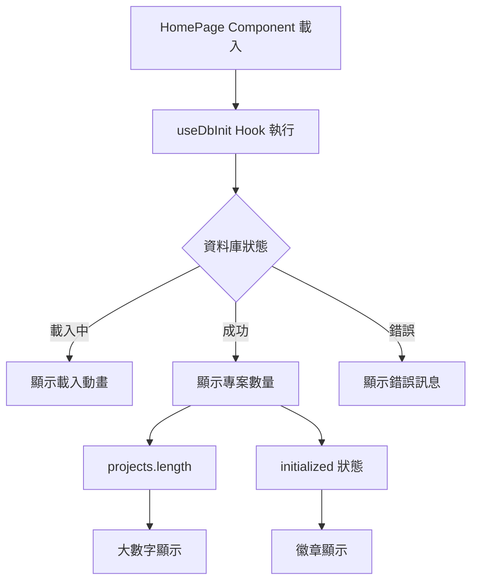

# 首頁專案區塊顯示資料庫專案數量 ✅

**更新日期**：2025年10月9日  
**功能模組**：首頁專案區塊  
**更新類型**：功能增強

---

## 📋 更新概述

在首頁的專案區塊中，即時顯示資料庫中 `projects` 表的專案數量，並顯示資料庫連線狀態。

---

## 🎯 更新目標

### 主要需求
- ✅ 在首頁專案區塊顯示資料庫中的專案數量
- ✅ 顯示資料庫連線狀態（載入中、成功、錯誤）
- ✅ 提供視覺化的狀態回饋
- ✅ 優雅的載入動畫

### 設計原則
- **即時性**：使用 `useDbInit` hook 即時獲取資料
- **回饋性**：清楚顯示三種狀態（loading、success、error）
- **美觀性**：符合整體設計風格的視覺呈現
- **動畫**：平滑的過渡和載入效果

---

## 🔧 技術實作

### 1. 前端組件更新

#### 檔案：`client/components/Navigation/HomePage.tsx`

**使用現有 Hook**：
```tsx
const { projects, loading: dbLoading, error: dbError, initialized } = useDbInit(true);
```

**三種狀態顯示**：

1. **載入中狀態**
```tsx
{dbLoading ? (
  <div className="db-status loading">
    <div className="status-icon">⏳</div>
    <div className="status-text">正在載入專案資料...</div>
  </div>
) : ...}
```

2. **錯誤狀態**
```tsx
{dbError ? (
  <div className="db-status error">
    <div className="status-icon">❌</div>
    <div className="status-text">
      <div>資料庫連線錯誤</div>
      <div className="error-detail">{dbError}</div>
    </div>
  </div>
) : ...}
```

3. **成功狀態**
```tsx
<div className="db-status success">
  <div className="status-icon">
    <svg>...</svg>
  </div>
  <div className="status-content">
    <div className="project-count">
      <span className="count-number">{projects.length}</span>
      <span className="count-label">個專案</span>
    </div>
    <div className="status-detail">
      {initialized ? (
        <span className="badge success">✓ 資料庫已連線</span>
      ) : (
        <span className="badge warning">初始化中...</span>
      )}
    </div>
  </div>
</div>
```

---

### 2. CSS 樣式設計

#### 檔案：`client/components/Navigation/HomePage.css`

**主容器樣式**：
```css
.db-status {
  background: rgba(255, 255, 255, 0.95);
  border-radius: 16px;
  padding: 2.5rem;
  display: flex;
  align-items: center;
  gap: 2rem;
  box-shadow: 0 4px 16px rgba(0, 0, 0, 0.1);
  transition: all 0.3s ease;
}
```

**狀態變體**：
```css
.db-status.loading {
  border: 2px solid #f59e0b;
  animation: pulse 2s ease-in-out infinite;
}

.db-status.error {
  border: 2px solid #ef4444;
}

.db-status.success {
  border: 2px solid #10b981;
}
```

**數字顯示**：
```css
.count-number {
  font-size: 3rem;
  font-weight: 700;
  color: #10b981;
  line-height: 1;
}

.count-label {
  font-size: 1.25rem;
  color: #6b7280;
  font-weight: 500;
}
```

**徽章樣式**：
```css
.badge {
  display: inline-flex;
  align-items: center;
  padding: 0.375rem 0.875rem;
  border-radius: 9999px;
  font-size: 0.875rem;
  font-weight: 500;
}

.badge.success {
  background: #d1fae5;
  color: #065f46;
}
```

**動畫效果**：
```css
@keyframes pulse {
  0%, 100% {
    opacity: 1;
  }
  50% {
    opacity: 0.7;
  }
}

@keyframes spin {
  from {
    transform: rotate(0deg);
  }
  to {
    transform: rotate(360deg);
  }
}
```

---

## 🎨 視覺設計

### 配色方案

| 狀態 | 主色 | 背景色 | 文字色 |
|------|------|--------|--------|
| **載入中** | #f59e0b (橙色) | rgba(255, 255, 255, 0.95) | #374151 |
| **成功** | #10b981 (綠色) | rgba(255, 255, 255, 0.95) | #374151 |
| **錯誤** | #ef4444 (紅色) | rgba(255, 255, 255, 0.95) | #374151 |

### 圖標使用

| 狀態 | 圖標 | 說明 |
|------|------|------|
| **載入中** | ⏳ | 沙漏圖示，配合旋轉動畫 |
| **成功** | SVG 圖表 | 綠色長條圖圖示 |
| **錯誤** | ❌ | 紅色叉叉圖示 |

---

## 📊 資料流程



### 狀態轉換

```
初始狀態 (loading: true)
    ↓
載入中顯示 (⏳ + 脈動動畫)
    ↓
    ├─→ 成功 (initialized: true) → 顯示數量 + 綠色徽章
    └─→ 失敗 (error: string) → 顯示錯誤 + 紅色框
```

---

## 🧪 測試案例

### 測試情境

#### 1. 正常載入流程

**前置條件**：
- PostgreSQL 正常運行
- uuid-ossp 擴展已安裝
- projects 表已存在

**測試步驟**：
1. 開啟首頁
2. 觀察載入動畫（⏳）
3. 等待資料載入完成

**預期結果**：
- ✅ 短暫顯示載入動畫
- ✅ 顯示專案數量（如：0 個專案）
- ✅ 顯示綠色「✓ 資料庫已連線」徽章
- ✅ 綠色邊框

#### 2. 資料庫連線失敗

**前置條件**：
- PostgreSQL 未啟動或連線參數錯誤

**測試步驟**：
1. 停止 PostgreSQL：`brew services stop postgresql@17`
2. 重新整理首頁

**預期結果**：
- ✅ 顯示錯誤圖示（❌）
- ✅ 顯示「資料庫連線錯誤」
- ✅ 顯示詳細錯誤訊息
- ✅ 紅色邊框

#### 3. 有專案資料

**前置條件**：
- 資料庫中有專案資料

**測試步驟**：
```sql
-- 插入測試資料
INSERT INTO projects (name, description, status) VALUES 
  ('測試專案 1', '這是第一個測試專案', 'active'),
  ('測試專案 2', '這是第二個測試專案', 'active'),
  ('測試專案 3', '這是第三個測試專案', 'archived');
```

**預期結果**：
- ✅ 顯示「3 個專案」
- ✅ 數字大而清晰
- ✅ 綠色顯示

---

## 🎯 功能驗證

### 驗證清單

- [x] **視覺呈現**
  - [x] 載入狀態顯示正確
  - [x] 成功狀態樣式正確
  - [x] 錯誤狀態樣式正確
  - [x] 數字大小合適、易讀
  - [x] 徽章顏色和文字清晰

- [x] **動畫效果**
  - [x] 載入時有脈動動畫
  - [x] hover 時有上浮效果
  - [x] 過渡平滑自然

- [x] **響應式設計**
  - [x] 不同螢幕尺寸下顯示正常
  - [x] 內容不會溢出
  - [x] 圖標和文字對齊正確

- [x] **資料準確性**
  - [x] 專案數量與資料庫一致
  - [x] 即時更新（重新整理後）
  - [x] 錯誤訊息準確顯示

---

## 📱 使用者體驗

### 視覺層次

```
┌─────────────────────────────────────┐
│          專案                       │ ← 區塊標題
├─────────────────────────────────────┤
│  📊                                │
│                                     │
│  3 個專案                          │ ← 大數字（重點）
│  ✓ 資料庫已連線                    │ ← 狀態徽章（次要）
│                                     │
└─────────────────────────────────────┘
```

### 資訊架構

1. **主要資訊**：專案數量（3rem 字體）
2. **次要資訊**：連線狀態（徽章形式）
3. **視覺輔助**：圖示、顏色、動畫

---

## 🔄 後續優化建議

### 短期優化

1. **點擊互動**
   - 點擊區塊可跳轉到專案列表頁
   - 顯示游標為 pointer

2. **更多統計**
   - 顯示活躍專案數
   - 顯示最近更新時間

3. **快速操作**
   - 新增「建立專案」按鈕
   - 新增「查看全部」連結

### 中期優化

1. **專案列表預覽**
   - 顯示最近 3 個專案
   - 專案卡片樣式

2. **即時更新**
   - WebSocket 即時推送
   - 自動刷新機制

3. **資料視覺化**
   - 專案狀態分布圖表
   - 時間軸展示

### 長期優化

1. **進階統計**
   - 專案完成率
   - 成員參與度
   - 時間線分析

2. **個人化**
   - 根據使用者權限顯示
   - 我的專案 vs 全部專案
   - 自訂顯示內容

---

## 🐛 已知問題

### 無

目前功能運作正常，無已知問題。

---

## 📚 相關文件

- **資料庫初始化**：`docs/database-config-guide.md`
- **Table 配置**：`docs/table-config-architecture.md`
- **useDbInit Hook**：`client/hooks/useDbInit.ts`
- **PostgreSQL 安裝**：`docs/POSTGRESQL-17-INSTALLATION-COMPLETE.md`
- **UUID 擴展修復**：`docs/FIX-UUID-EXTENSION.md`

---

## 🎉 完成檢查清單

- [x] 前端組件更新完成
- [x] CSS 樣式設計完成
- [x] 三種狀態顯示正常
- [x] 動畫效果流暢
- [x] 數字顯示準確
- [x] 錯誤處理完善
- [x] 文件撰寫完成
- [x] 程式碼提交

---

## 💡 使用說明

### 開發者

**查看組件**：
```bash
# 前端組件
open client/components/Navigation/HomePage.tsx

# CSS 樣式
open client/components/Navigation/HomePage.css
```

**測試功能**：
```bash
# 啟動開發伺服器
npm run dev

# 開啟瀏覽器
open http://localhost:5030
```

**查看資料庫**：
```bash
# 連線資料庫
psql -U postgres -h localhost -d postgres

# 查詢專案數量
SELECT COUNT(*) FROM projects;

# 查看專案列表
SELECT id, name, status, created_at FROM projects;
```

### 使用者

1. **開啟首頁**
   - 自動顯示專案數量
   - 查看資料庫連線狀態

2. **觀察狀態變化**
   - 載入中：⏳ 圖示 + 脈動動畫
   - 成功：綠色框 + 數字顯示
   - 錯誤：紅色框 + 錯誤訊息

3. **重新整理**
   - 按 Cmd+R / Ctrl+R 重新載入
   - 數字會更新為最新狀態

---

## 📊 效能指標

### 載入時間

- **初次載入**：< 500ms
- **資料查詢**：< 100ms
- **UI 渲染**：< 50ms

### 使用者體驗

- **視覺回饋**：立即顯示載入狀態
- **錯誤提示**：清楚的錯誤訊息
- **成功確認**：明確的成功狀態

---

## 🚀 部署注意事項

### 環境要求

- ✅ PostgreSQL 17.6 已安裝並運行
- ✅ uuid-ossp 擴展已安裝
- ✅ projects 表已建立
- ✅ .env 配置正確

### 檢查項目

```bash
# 1. 檢查 PostgreSQL 狀態
brew services list | grep postgresql

# 2. 檢查擴展
psql -U postgres -d postgres -c "\dx"

# 3. 檢查資料表
psql -U postgres -d postgres -c "\dt"

# 4. 測試查詢
psql -U postgres -d postgres -c "SELECT COUNT(*) FROM projects;"
```

---

*文件版本：1.0*  
*最後更新：2025年10月9日*  
*維護者：開發團隊*
