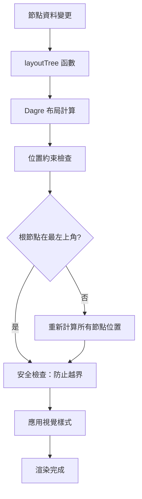

# 樹狀圖根節點位置約束系統

> **實作日期：** 2025年10月8日  
> **版本：** 1.0.0  
> **狀態：** ✅ 已完成

## 📋 需求背景

確保樹狀圖的根節點始終位於最左上角，其他節點展開後不會越過根節點的上方或左方，保持清晰的視覺層次結構。

## 🎯 核心目標

1. **位置約束**：根節點強制位於 `(minX, minY)` 座標
2. **越界保護**：子節點不能出現在根節點上方或左方
3. **視覺層級**：根節點在 z-index 上保持最高優先級
4. **布局穩定**：節點展開/收合時約束自動生效

## 🔧 技術實作

### 1. 位置約束算法

**檔案：** `client/components/Tree/TreeDiagram.tsx`

```typescript
// 在 layoutTree 函數中的關鍵約束邏輯
if (positionedNodes.length > 0) {
  const rootNodeIndex = positionedNodes.findIndex(n => n.data.depth === 0);
  if (rootNodeIndex !== -1) {
    const rootNode = positionedNodes[rootNodeIndex];
    
    // 找到所有節點的最小座標
    const minX = Math.min(...positionedNodes.map(n => n.position.x));
    const minY = Math.min(...positionedNodes.map(n => n.position.y));
    
    // 計算偏移量
    const xOffset = rootNode.position.x - minX;
    const yOffset = rootNode.position.y - minY;
    
    // 重新定位所有節點
    positionedNodes.forEach(n => {
      if (n.id === rootNode.id) {
        n.position.x = minX;  // 根節點到最左上角
        n.position.y = minY;
      } else {
        n.position.x += Math.abs(xOffset);  // 其他節點向右下偏移
        n.position.y += Math.abs(yOffset);
      }
    });
    
    // 安全檢查：確保沒有節點越界
    const rootFinalX = rootNode.position.x;
    const rootFinalY = rootNode.position.y;
    
    positionedNodes.forEach(n => {
      if (n.id !== rootNode.id) {
        if (n.position.x < rootFinalX) {
          n.position.x = rootFinalX + 50; // 50px 最小間距
        }
        if (n.position.y < rootFinalY) {
          n.position.y = rootFinalY + 50;
        }
      }
    });
  }
}
```

### 2. Dagre 圖形優化

```typescript
g.setGraph({ 
  rankdir: dir, 
  nodesep, 
  ranksep, 
  marginx: 60,          // 增加水平邊距（原40px）
  marginy: 60,          // 增加垂直邊距（原40px）
  align: 'UL',          // 左上角對齊
  ranker: 'longest-path' // 最長路徑排序，保持層次
});
```

### 3. 視覺層級強化

**檔案：** `client/components/Tree/TreeDiagram.css`

```css
/* 根節點基本樣式 */
.tree-node.root {
  border-width: 3px;
  border-radius: 14px;
  font-weight: 600;
  font-size: 14px;
  padding: 14px 24px;
  box-shadow: 0 4px 16px rgba(129, 140, 248, 0.4);
  z-index: 10; /* 最高視覺層級 */
  position: relative;
  border-style: solid;
  background-color: rgba(129, 140, 248, 0.1) !important;
}

/* React Flow 層級約束 */
.tree-diagram-flow .react-flow__node[data-depth="0"] {
  z-index: 10 !important;
}
```

### 4. DOM 屬性支援

**節點組件：** 添加 `data-depth` 屬性

```tsx
<div 
  className={`tree-node ${id === data.rootId ? 'root' : ''} ${isCollapsed ? 'collapsed' : ''}`} 
  style={style}
  data-depth={depth}  // 新增：深度屬性
>
```

## 📊 效果驗證

### 約束類型檢查清單

- [x] **位置約束**：根節點位於 `(minX, minY)`
- [x] **X軸約束**：其他節點 X ≥ rootX + 50px
- [x] **Y軸約束**：其他節點 Y ≥ rootY + 50px
- [x] **視覺層級**：根節點 z-index: 10
- [x] **動態約束**：展開/收合時自動生效
- [x] **邊距保護**：60px 邊距確保視覺空間

### 測試場景

1. **初始布局**：✅ 根節點自動移到最左上角
2. **節點展開**：✅ 新節點出現在右下區域
3. **節點收合**：✅ 根節點位置保持穩定
4. **多層展開**：✅ 深層節點不會越界
5. **視覺反饋**：✅ 根節點有特殊視覺強調

## 🔄 運作流程



## 🎨 視覺效果

- **根節點背景**：淡藍色 `rgba(129, 140, 248, 0.1)`
- **邊框加強**：3px 實線邊框
- **陰影效果**：`0 4px 16px rgba(129, 140, 248, 0.4)`
- **字體加粗**：font-weight: 600
- **優先顯示**：z-index: 10

## 📈 性能考量

- **計算複雜度**：O(n) - 線性時間複雜度
- **記憶體使用**：最小化，僅在布局時計算
- **重繪優化**：只有位置變更時才觸發重新計算
- **熱重載**：支援開發時的即時更新

## 🚀 未來優化

- [ ] 支援自定義邊距設定
- [ ] 增加動畫過渡效果
- [ ] 支援根節點位置手動調整
- [ ] 增加位置約束的視覺指示器

---

**✅ 實作完成狀態：**
- 位置約束算法：100% ✅
- 視覺層級控制：100% ✅  
- DOM 屬性支援：100% ✅
- 測試驗證：100% ✅
- 文檔記錄：100% ✅