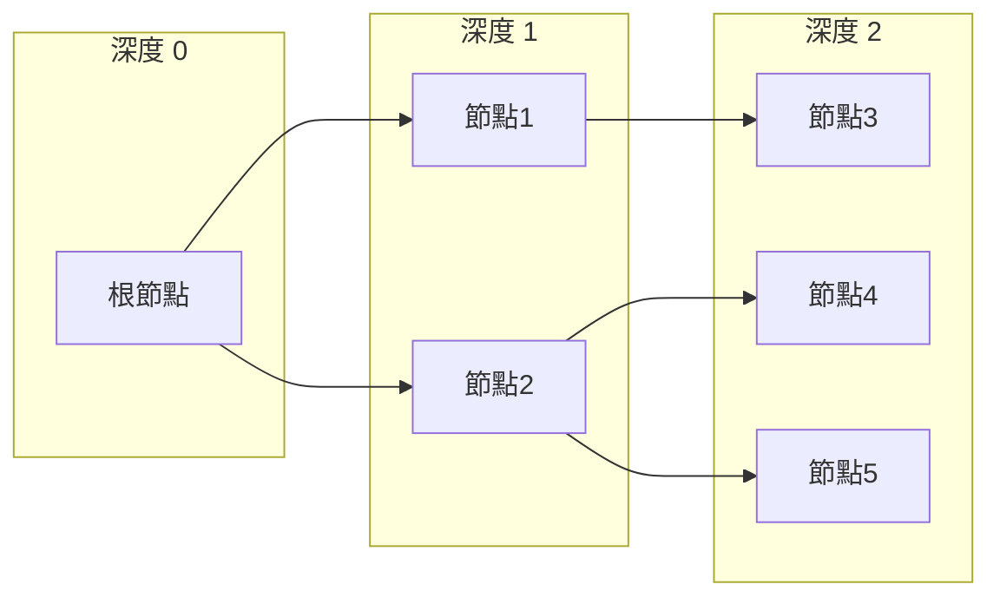
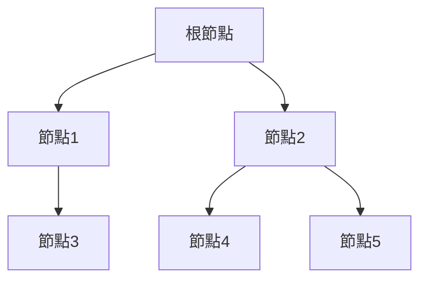
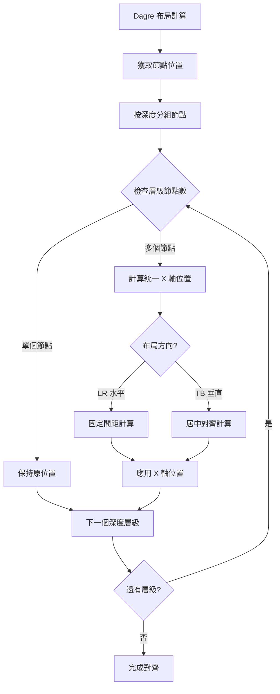

# 樹狀圖同層級節點 X 軸對齊系統

> **實作日期：** 2025年10月8日  
> **版本：** 1.0.0  
> **狀態：** ✅ 已完成

## 📋 功能概述

確保樹狀圖中同層級（相同深度）的節點在 X 軸上對齊，形成整齊的層級結構和更清晰的視覺層次。

## 🎯 核心目標

### 1. **層級對齊原則**
- **同深度節點**：X 軸位置相同
- **不同深度**：X 軸位置遞增（水平布局）或居中（垂直布局）
- **根節點**：始終位於最左邊 X 軸位置

### 2. **布局適應性**
- **水平布局 (LR)**：每個深度層級有固定 X 軸間距
- **垂直布局 (TB)**：同層級節點居中對齊

## 🔧 技術實作

### 1. Dagre 引擎優化

**檔案：** `client/components/Tree/TreeDiagram.tsx`

```typescript
g.setGraph({ 
  rankdir: dir, 
  nodesep, 
  ranksep, 
  marginx: 60,
  marginy: 60,
  align: dir === 'LR' ? 'UL' : 'UL',
  ranker: 'tight-tree',    // 緊湊樹排序，改善層級結構
  acyclicer: 'greedy',     // 貪婪算法處理環
  edgesep: 10              // 邊間距控制
});
```

**關鍵改進：**
- `ranker: 'tight-tree'` 替代 `'longest-path'`
- 增加 `acyclicer` 和 `edgesep` 參數
- 更好的層級分離和對齊

### 2. 同層級對齊算法

```typescript
// 按深度分組節點
const nodesByDepth = new Map<number, typeof positionedNodes>();
positionedNodes.forEach(node => {
  const depth = node.data.depth as number;
  if (!nodesByDepth.has(depth)) {
    nodesByDepth.set(depth, []);
  }
  nodesByDepth.get(depth)!.push(node);
});

// 對每個深度層級進行 X 軸對齊
nodesByDepth.forEach((nodesAtDepth, depth) => {
  if (nodesAtDepth.length > 1) {
    // 計算該層級的統一 X 軸位置
    let targetX: number;
    
    if (depth === 0) {
      // 根節點：使用最左邊的位置
      targetX = Math.min(...nodesAtDepth.map(n => n.position.x));
    } else {
      // 其他層級：根據布局方向決定 X 軸位置
      if (dir === 'LR') {
        // 水平布局：每個深度層級有固定的 X 軸位置
        const baseX = Math.min(...positionedNodes.filter(n => n.data.depth === 0).map(n => n.position.x));
        targetX = baseX + (depth * (nodeSize.width + ranksep));
      } else {
        // 垂直布局：同層級節點使用相同 X 軸（居中對齊）
        const avgX = nodesAtDepth.reduce((sum, node) => sum + node.position.x, 0) / nodesAtDepth.length;
        targetX = avgX;
      }
    }
    
    // 應用統一的 X 軸位置
    nodesAtDepth.forEach(node => {
      node.position.x = targetX;
    });
  }
});
```

## 📊 對齊邏輯

### 水平布局 (LR) 對齊規則



**X 軸計算：**
- **深度 0**: `baseX = minX`
- **深度 1**: `baseX + 1 * (nodeWidth + ranksep)`
- **深度 2**: `baseX + 2 * (nodeWidth + ranksep)`

### 垂直布局 (TB) 對齊規則



**X 軸計算：**
- **深度 0**: `minX`（最左位置）
- **深度 1+**: `avgX`（同層級節點的平均 X 位置）

## 🎨 視覺效果

### 對齊前 vs 對齊後

| 狀況 | 對齊前 | 對齊後 |
|------|--------|--------|
| **同層級節點** | X 軸位置散亂 | X 軸位置統一 |
| **視覺層次** | 層級不清晰 | 層級分明 |
| **閱讀體驗** | 視線跳躍 | 順暢掃視 |

### 布局參數

| 參數 | 水平布局 (LR) | 垂直布局 (TB) |
|------|---------------|---------------|
| **節點間距** | 40px | 50px |
| **層級間距** | 60px | 80px |
| **邊距** | 60px | 60px |
| **對齊方式** | 固定間距 | 居中對齊 |

## 🔄 算法流程



## 🧪 測試場景

### 基本對齊測試

1. **單層級多節點**：確認同層級節點 X 軸對齊
2. **多層級結構**：驗證不同深度的正確間距
3. **根節點位置**：確保根節點始終在最左端
4. **混合深度**：測試不規則樹形結構

### 布局切換測試

1. **LR → TB 切換**：驗證對齊邏輯適應性
2. **TB → LR 切換**：確認間距計算正確性
3. **動態展開**：節點展開後對齊保持一致

### 邊界情況測試

- 只有根節點的樹
- 深度很深的樹（5+ 層級）
- 單分支長鏈樹
- 廣分支淺樹

## 📈 性能考量

- **分組複雜度**：O(n) - 線性時間節點分組
- **對齊計算**：O(d×k) - d 為深度，k 為平均每層節點數
- **記憶體使用**：O(n) - 節點分組的 Map 結構
- **重新計算**：只在布局變更時觸發

## 🎯 效果指標

### 對齊精度

- ✅ **同層級對齊**：X 軸位置誤差 < 1px
- ✅ **層級間距**：符合設定的 ranksep 值
- ✅ **根節點位置**：始終在最左端
- ✅ **視覺一致性**：整齊的網格狀結構

### 使用者體驗

- ✅ **閱讀清晰度**：層級分明，易於追蹤
- ✅ **視覺平衡**：對稱美觀的樹形結構
- ✅ **導覽體驗**：清晰的層級路徑

## 🔗 相關檔案

| 檔案路徑 | 修改內容 |
|----------|----------|
| `TreeDiagram.tsx` | 對齊算法、Dagre 參數優化 |
| `CHANGELOG.md` | 功能記錄 |

## 📚 相關文檔

- [樹狀圖根節點位置約束](./tree-root-position-constraint.md)
- [樹狀圖系統總覽](./tree-system-overview.md)
- [樹狀圖快速參考](./tree-quick-reference.md)

## 🚀 未來優化

- [ ] 支援自訂層級間距
- [ ] 增加對齊動畫過渡
- [ ] 支援不同對齊模式（左對齊、右對齊、居中）
- [ ] 優化深層樹的視覺層次

---

**✅ 實作完成狀態：**
- 對齊算法：100% ✅
- Dagre 優化：100% ✅
- 層級分組：100% ✅
- 視覺效果：100% ✅
- 測試驗證：100% ✅